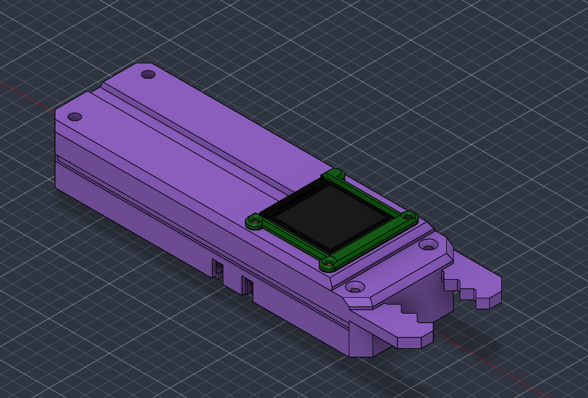

# BeyBeetle (WIP)



The BeyBeetle is a custom tool used to measure the angle and RPM of beyblade launches. This repo contains instructions and resources to create a BeyBeetle of your own!

## Design Philosophy

The BeyBeetle is built from easily available, commercial-off-the-shelf (COTS) hardware, so that it can easily be assambled by people who have limited tools, knowledge, resources and space. Even the 3D printed chasis and bill of materials (BOM) are easily aquired through online printing services and hardware vendors. 

All the code and instructions on how to compile, as well as links to recently compiled and up-to-date .uf2 files are included here, so that enthusiasts of all walks are able to build a BeyBeetle should they want to. 

Why a Beetle? I like beetles, they are one of my favourite animals and my other projects feature them as well. 

## What it does

The BeyBeetle reads launch angle from an IMU strapped to your launcher, and will read rotational speed from an IR interrupt sensor once that part is done. On boot it runs a splash while it checks the display, the IMU and the battery gauge, then drops you straight into the bubble screen — there's no menu to fight your way through.

**The bubble screen** is a spirit level for your launcher. Concentric rings mark 15°, 30° and 45° off-axis, and an orange dot moves in real time as you tilt — think of it like a crosshair you're trying to keep centred. Floating beside the dot are your pitch and roll in degrees, each with a little arrow pointing the way you need to correct. Readings are smoothed with an exponential moving average so the display doesn't jitter, and a small battery icon in the corner keeps an eye on charge level so you're not caught out mid-session.

**Locking in** happens through the micro switch the beyblade presses against when it's seated in the launcher. Hold it down and the screen arms itself — the corner crosses spin into place and ARMED tape scrolls down the left edge and along the bottom, so you can tell at a glance that the meter is watching.

**Launching** is just letting go. The instant the beyblade leaves, a green mark drops at exactly the angle you were holding — it flickers for a second, twists from a + into an X, and settles with the angle numbers alongside it. Arm up for your next shot and that mark greys out but stays put, so you can chase the same angle again when the last launch was a good one. Only the previous launch is kept, and it lives behind the live dot so it never gets in the way.

**Sleep** kicks in after three minutes without anything locked in. The screen blanks, the sensors power down and the RP2040 goes fully dormant — no reading, no calculating, nothing. Hold the lock switch for three seconds and it wakes up and boots from scratch, checks and all. Worth knowing: the display's backlight is wired permanently on, so until I run a wire to a spare pin, sleep saves a lot less power than it ought to.

## Roadmap

Launch detection is done — the micro switch catches the moment the beyblade leaves, so the angle that gets recorded is the angle at the point of release rather than whatever you happened to be holding a second beforehand. Everything below builds on that.

**1. RPM mode**
The IR sensor has a home on the board but nothing in the firmware reads it yet. The goal is a reliable launch RPM logged alongside the angle you already get. This is the headline feature and it'll get done properly rather than rushed.

**2. Stats and recall**
Right now the meter remembers your last launch and nothing else, and even that goes when you power it down. Once RPM is in, the records worth keeping — top shoot speed, total launch count — go into flash so they survive a power cycle, with a screen to show them off.

**3. Polish and wrap-up**
The final stretch — finishing the 3D printed chassis, running the backlight wire so sleep actually saves the battery it's meant to, tightening up the UI, and general improvements that come out of actually using the thing in the field.

## First-time setup

Open WSL and run these steps:

**1. Install the toolchain**
```bash
sudo apt install cmake gcc-arm-none-eabi libnewlib-arm-none-eabi build-essential
```

**2. Clone the Pico SDK**
```bash
git clone https://github.com/raspberrypi/pico-sdk ~/pico-sdk
cd ~/pico-sdk && git submodule update --init
echo 'export PICO_SDK_PATH=~/pico-sdk' >> ~/.bashrc && source ~/.bashrc
```

**3. Clone the libraries**
```bash
cd ~/BeyMeter
mkdir lib
git clone https://github.com/libdriver/st7789 lib/st7789
git clone https://github.com/STMicroelectronics/ism330dhcx-pid lib/ism330dhcx-pid
```

That's it — you only need to do this once.

## Every day usage

From `~/BeyMeter`:

```bash
make uf2    # clean build → BeyMeter.uf2
make hex    # clean build → BeyMeter.hex
make build  # incremental build (faster, no clean)
make clean  # wipe build artifacts
```

## Flashing

1. Hold **BOOTSEL** on the Feather and plug it into USB
2. It appears as a drive called `RPI-RP2` in Windows Explorer
3. Drag `BeyMeter.uf2` onto the drive — it reboots automatically

## Previewing the screens

Both stdio outputs are switched off in `CMakeLists.txt`, so there's no serial to watch — turn `pico_enable_stdio_usb` back on if you need it for debugging.

If you just want to see the screens without flashing anything, open [`tools/sim.html`](tools/sim.html) in a browser. It's a reimplementation of the display in JavaScript at the same 240x240, with the mouse aiming the launcher and buttons for the lock switch and the rip cord, so you can watch the arming animation and the launch mark without picking up a beyblade. It doesn't sync itself with the firmware, so if you change how something is drawn in `src/screens.c`, change it there too.

## Hardware

| Component | Connection | Purpose |
|-----------|------------|------------|
| Adafruit Feather RP2040 | — | Main board |
| ISM330DHCX IMU | STEMMA QT (I2C) | Tilt and pitch angle measurement |
| MAX17048 LiPo fuel gauge | STEMMA QT (I2C) | Battery management |
| TRCT5000 IR sensor | GPIO | RPM measurement (not read by the firmware yet) |
| D2F micro switch | GPIO |  Beyblde "lock-in" detection |
| Adafruit EyeSPI | SPI | Enables FFC cable connection |
| Adafruit 4313 1.3" 240x240 TFT IPS display | EyeSPI | Display |

Full bill of materials in [`bom/`](bom/).
